# LearnEase Pro – Capstone Project Writeup

## Project Overview

LearnEase Pro is a full-stack eLearning management application developed as the capstone project for the Purdue University Full-Stack Development with Generative AI certification program.

The project was built using the MERN stack: MongoDB, Express, React, and Node.js. It supports three distinct user roles—administrator, faculty, and student—and provides connected workflows for account management, course creation, enrollment, coursework completion, progress tracking, course reviews, and collaborative group chats.

I selected the eLearning project from the available capstone options because it provided the strongest opportunity to apply the full range of practical full-stack development skills covered throughout the program. My primary goal was to create a complete MERN application that could reinforce my understanding of full-stack development while also serving as a professional portfolio demonstration of my coding skills.

### Administrator Dashboard

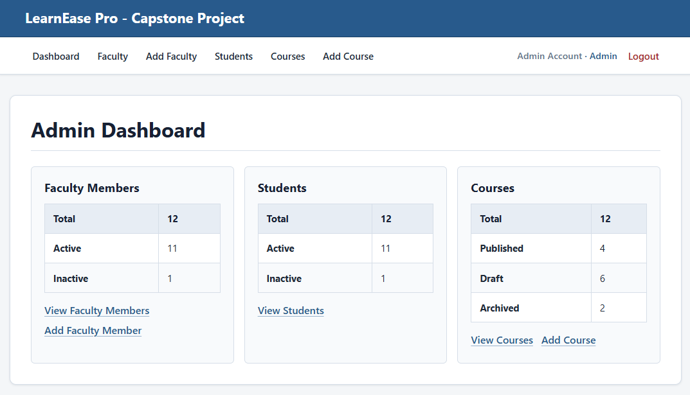
_Figure 1: Administrator dashboard showing user and course summary information._

## Application Design and Architecture

The initial capstone lectures established the basic MVC-style structure of the application, including the core backend layers and minimal user functionality. As I continued development independently, I chose to preserve and expand this architecture rather than simplify the application as its functionality grew.

The Express backend separates responsibilities across routes, middleware, controllers, services, repositories, and Mongoose models. A typical request flows through the application as follows:

**React Client → Express Route/Middleware → Controller → Service → Repository → Mongoose Model → MongoDB**

Continuing to develop the project with this structure added more complexity than a simplified implementation, but it also provided one of the most valuable learning opportunities in the project. It helped me understand where data exists at different stages of an application and which layer should be responsible for validating, modifying, retrieving, or returning that data.

The frontend is implemented with React and Vite. React components manage the user interface and role-specific workflows, while Axios service modules communicate with the REST API.

The final interface uses straightforward CSS without a component library or utility framework. Shared styles and responsive adjustments provide consistent navigation, page containers, forms, tables, buttons, status indicators, feedback messages, course content, and discussion interfaces across all three roles. This approach kept the presentation professional and cohesive without obscuring the underlying React structure.

Maintaining and extending this architecture became one of the parts of the project I am most proud of because it transformed concepts introduced during the course into a practical understanding of application data flow and separation of responsibilities.

## User Roles and Core Features

LearnEase Pro supports administrator, faculty, and student users.

Administrators function as the primary system-management role. They can manage faculty and student accounts, create and assign courses, monitor application statistics, and control course lifecycle states including draft, published, and archived courses.

Faculty users can manage assigned courses, create and organize coursework, upload course resources, publish courses, review student enrollment requests, and participate in course discussions.

Students can create accounts, manage profiles, browse published courses, request enrollment, access approved coursework, track their progress, participate in group discussions, and submit a course rating and review after completing required coursework.

The application also includes a customizable group-chat auto-refresh preference, providing a user-specific configurable setting.

### Faculty Course Details

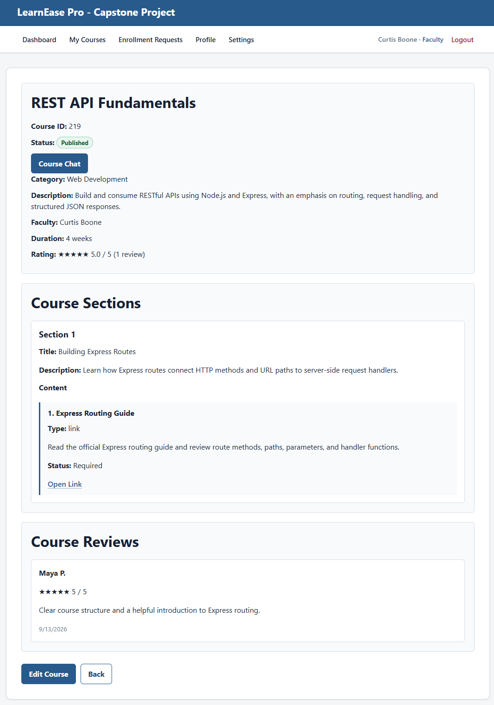
_Figure 2: Faculty view of course details including coursework sections and content._

### Course Editor

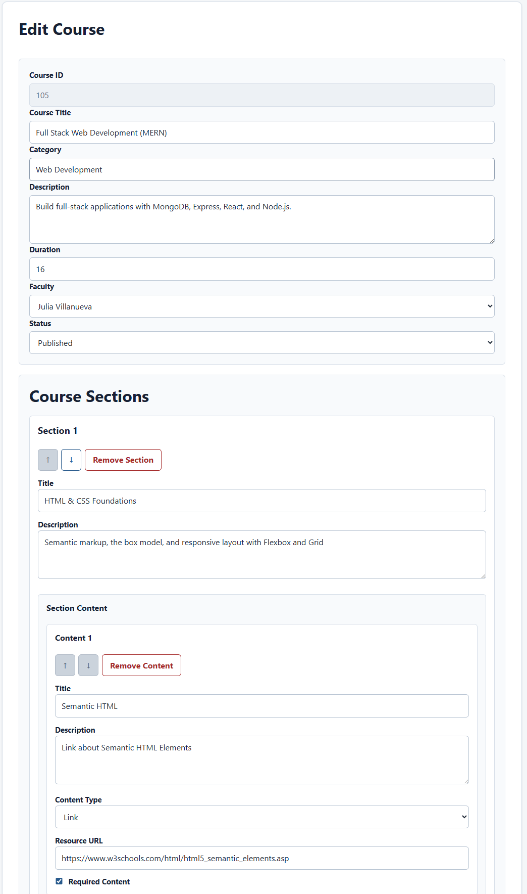
_Figure 3: Course editor showing a section and its associated linked content._

### Faculty Enrollments

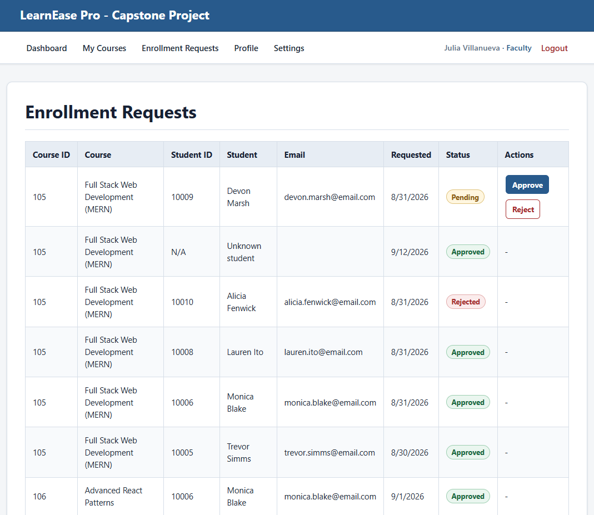
_Figure 4: Faculty Enrollment Requests showing approved, pending and rejected statuses._

### Student Course Browser

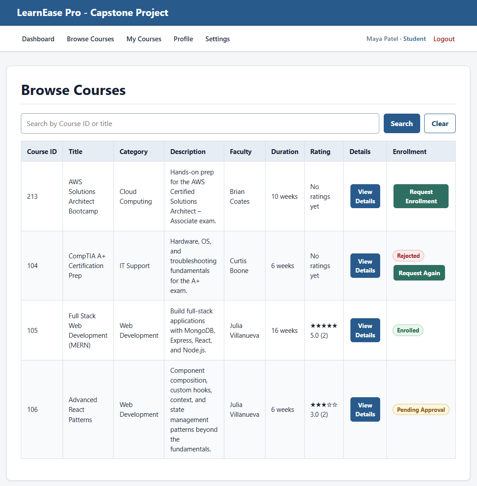
_Figure 5: Student course browsing with approved, pending and rejected enrollment statuses._

### Student Profile

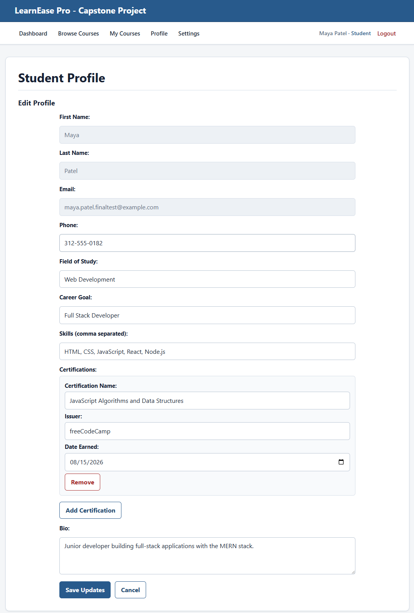
_Figure 6: Student profile edit form showing academic and professional information._

### Student User Settings

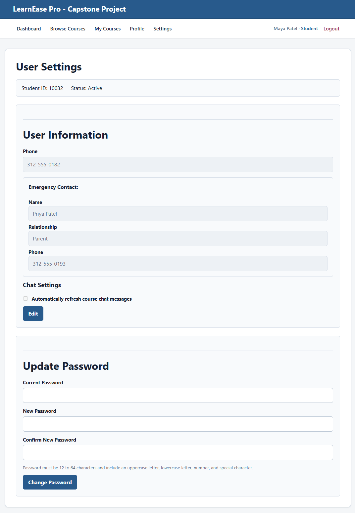
_Figure 7: Student account settings including emergency contact information, chat auto-refresh, and password controls._

## Authentication and Authorization

Authentication and authorization were among the most important and challenging aspects of the project.

The application uses JSON Web Tokens for authenticated sessions and bcrypt for password hashing. Protected requests verify the user's token and current account before applying role- and resource-based permissions. This ensures that deleted or deactivated users cannot continue accessing the application with an older token and that users can only access resources appropriate to their role and relationship to a course. Uploaded course files are also protected through the API rather than being publicly accessible.

Throughout development, I deliberately chose to enforce important permissions and business decisions on the backend whenever possible rather than relying on the client interface to prevent unauthorized actions. For example, hiding a button may improve the user experience, but the backend still determines whether that user is actually authorized to perform the action.

This approach was especially important because the application contains three interconnected user types. Adding an administrator role with cross-resource management permissions introduced more complexity than I initially expected because each workflow required consideration of which users could access or modify a particular resource.

Working through these requirements greatly improved my understanding of authentication, authorization, middleware, ownership rules, and secure client-server data flow.

## Course and Learning Workflow

Courses move through draft, published, and archived lifecycle states. Human-readable numeric course IDs are generated according to course level, while MongoDB ObjectIds are used internally for document relationships and authorization.

Students can browse published courses and request enrollment. Faculty members assigned to those courses can approve or reject enrollment requests.

Once approved, students gain access to the course's coursework and protected resources. Required course content can be marked complete, and progress is calculated by the server based on the course's current required content.

Students who complete all required coursework may submit one course rating and review.

The application also includes a course-specific group chat that allows authorized users to participate in collaborative discussions. Users may manually refresh the conversation or enable automatic refresh through their account settings.

Archived courses remain available to assigned faculty and approved students for historical access. Faculty editing is disabled, and existing course discussions remain visible in a read-only state while the API prevents new messages.

### Student Course Details

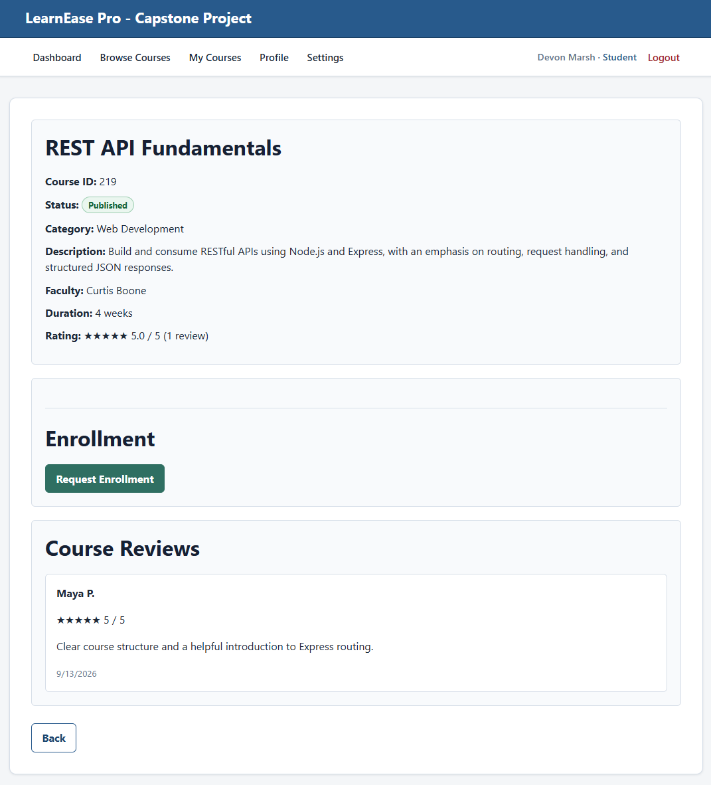
_Figure 8: Student Course overview with a course review and enrollment request option._

### Student Coursework

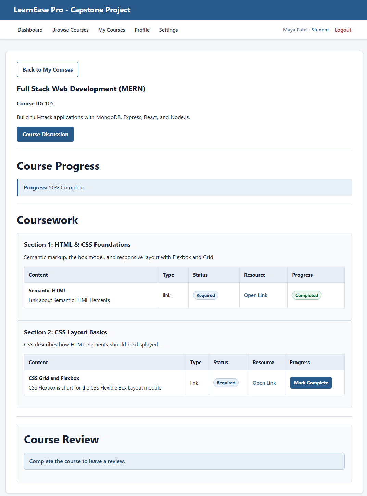
_Figure 9: Student coursework page showing course progress._

### Coursework Review

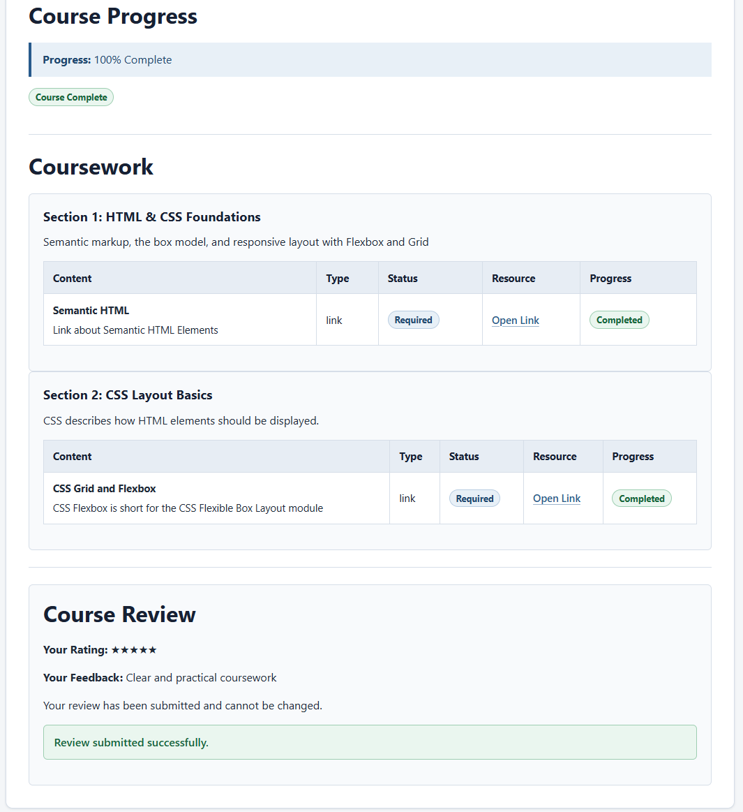
_Figure 10: Student submitted review after coursework completion._

### Course Chat

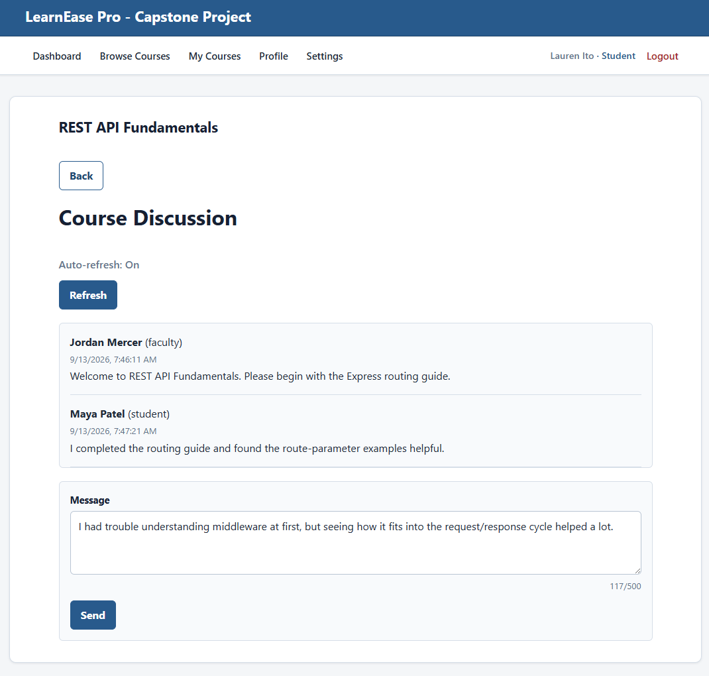
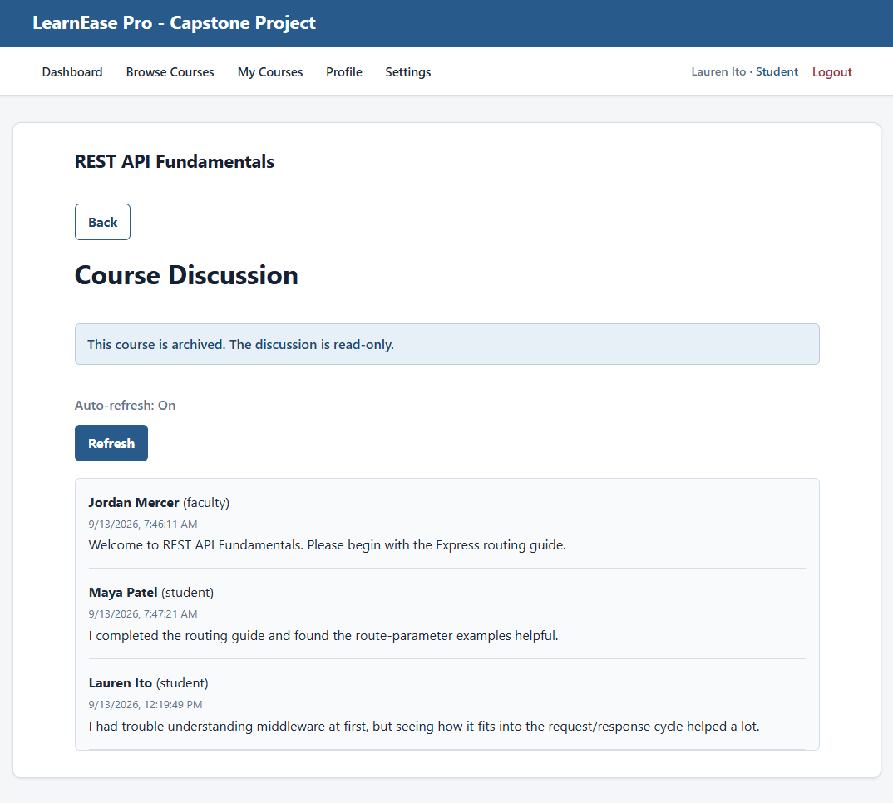
_Figures 11 and 12: Course discussion shown in active and archived read-only states._

## Development Challenges and Learning Outcomes

The greatest challenge during development was understanding the complete flow of application data and determining where individual operations and responsibilities belonged.

As the application grew, I had to consider whether a particular responsibility belonged in the React client, Express middleware, controller, service layer, repository, Mongoose model, or MongoDB database. Maintaining the layered architecture gave me a practical framework for understanding which part of the application should be responsible for the data at each stage of a request.

Authentication and authorization added another dimension to this challenge. It was not enough to understand where the data was going; I also needed to determine which authenticated user should be permitted to access or modify it throughout that flow.

The project also substantially improved my practical understanding of React, particularly component state, effects, API-driven interfaces, and the relationship between frontend state and persistent backend data.

Overall, the project became larger than I initially expected, but maintaining its structure throughout that growth was an important part of the learning experience.

## Use of Generative AI

Generative AI was used as a development and learning tool throughout the project.

I primarily used AI for explanations of programming concepts, implementation guidance, debugging assistance, architecture discussions, code review, and final project review. AI was also used to assist with project documentation.

I intentionally treated AI-generated suggestions as material to understand and evaluate rather than code to accept automatically. During the primary development process, I manually incorporated relevant portions only after understanding their purpose and determining how they fit the application’s existing architecture and data flow. I then verified the resulting behavior through manual testing and API testing.

This was particularly important to me because the goal of the capstone was to convert conceptual knowledge from the certification program into practical coding ability rather than simply produce a functioning application.

The primary portion of the application produced directly through AI generation was the final CSS styling, along with a limited number of bounded corrections during final code review. The functional application architecture and its features were developed iteratively while I worked through and learned the underlying implementation.

## Testing and Final Review

The finished application was tested across administrator, faculty, and student workflows.

Testing included manual browser-based end-to-end testing of the major application workflows as well as Postman testing of API endpoints, authentication, authorization, validation, and error responses. I also completed client linting and verified that the application successfully produced and ran from a Vite production build.

Before finalizing the project, I completed a broader review of the codebase for consistency, architecture, unused code, authentication and authorization behavior, error handling, and overall application functionality.

A final disposable automated verification pass also exercised connected workflows including authentication, role restrictions, course publication, enrollment approval, coursework completion, discussions, reviews, profile ownership, and account deactivation. The generated test data was removed afterward, and a permanent automated test suite was intentionally kept outside the capstone’s scope.

This final review helped ensure that the finished project functioned as a cohesive application rather than as a collection of independently implemented features.

## Future Development

If development continued beyond the capstone, I would first add a repeatable automated integration and end-to-end test suite. Additional production-oriented improvements could include authentication rate limiting, secure HTTP-only cookie sessions with an appropriate CSRF strategy, managed object storage for uploaded files, and centralized application logging.

From a feature perspective, I would expand the coursework and communication systems. The current architecture could support richer coursework functionality, more advanced course discussions, user profile visibility, and direct messaging between users.

These additions would build naturally on the existing relationships between students, faculty members, courses, and enrollments.

## Conclusion

LearnEase Pro became a more substantial project than I originally anticipated, but that complexity ultimately made the capstone more valuable.

I am particularly proud of maintaining a structured architecture and taking the time to understand each part of the application rather than focusing only on reaching a functioning final result.

In an environment where generative AI can make it easy to produce code without fully understanding it, I deliberately used the project as an opportunity to do the difficult conceptual work behind the implementation.

The finished application demonstrates not only the features required for the capstone but also my improved understanding of full-stack application architecture, client-server communication, React development, database relationships, authentication, authorization, and practical software development.
